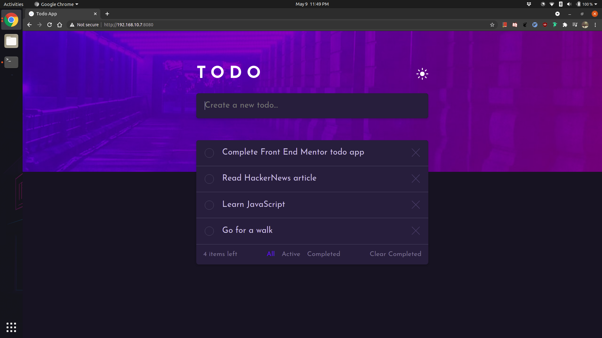
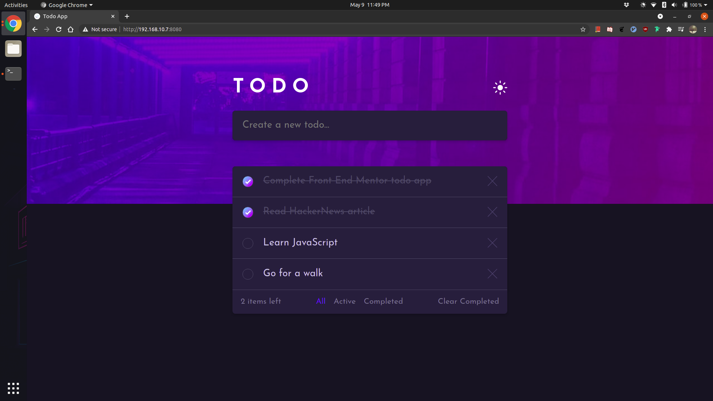
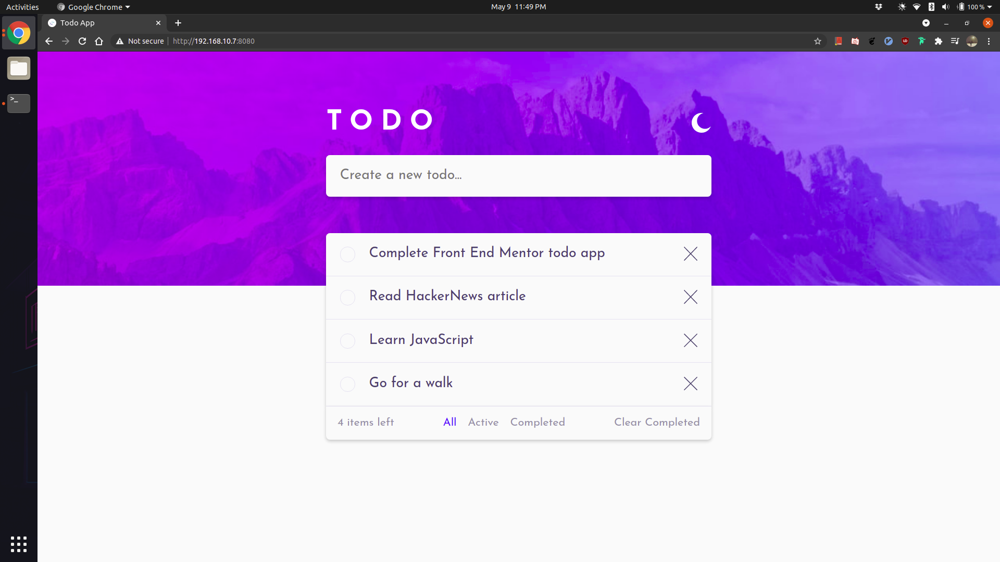
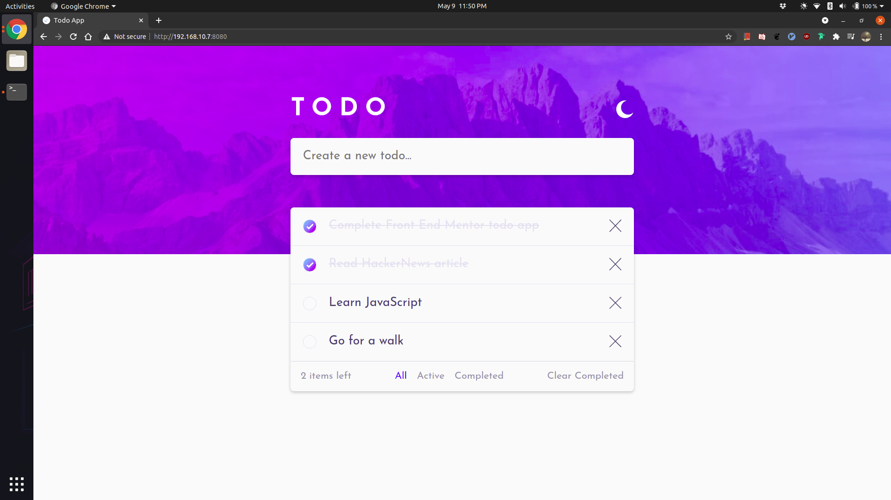

# todo list challenge of [front end mentor](https://www.frontendmentor.io/challenges/todo-app-Su1_KokOW)

# screenshots

## dark mode

## dark mode checked

## light mode

## light mode checked

# installation

This project uses SASS. So a SASS preprocessor is required to build the css
file. The css file should go inside a `css` directory under `src`.
